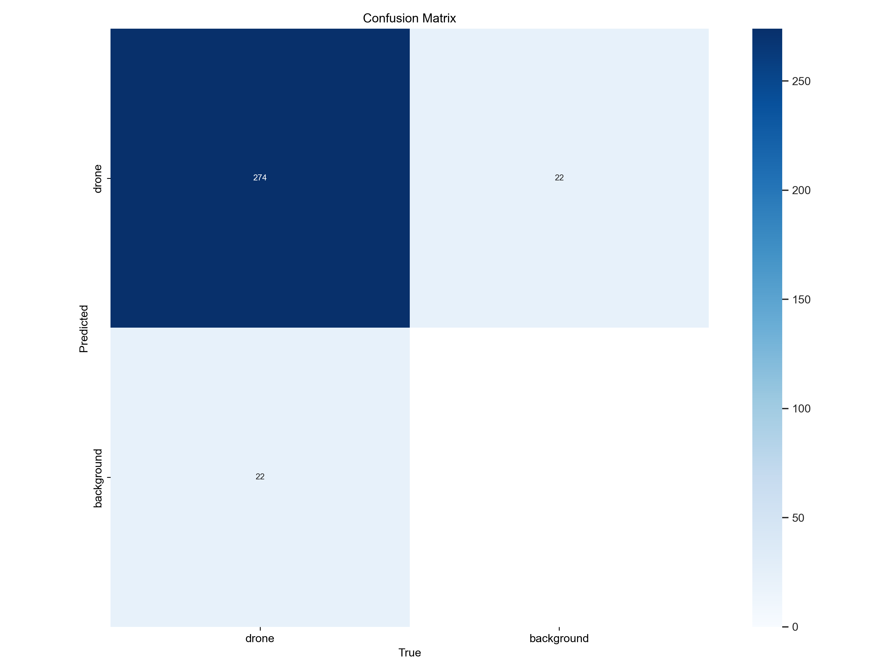

# Drone Detection System using YOLOv8

A deep learning-based system for detecting drones in images and video streams using YOLOv8.

## Project Overview

This project leverages the power of YOLOv8 (You Only Look Once version 8) to create a robust drone detection system. Through careful fine-tuning and optimization, we've developed a model that excels at identifying drones in various environmental conditions.

### Model Development Pipeline

1. **Base Model Selection**
   - Started with YOLOv8n (nano) as the foundation
   - Chosen for optimal balance between speed and accuracy
   - Pre-trained on COCO dataset with 80 classes

2. **Fine-Tuning Process**
   - Trained on custom drone dataset with 50 epochs
   - Utilized transfer learning to adapt pre-trained weights
   - Implemented early stopping with patience=20 to prevent overfitting
   - Training completed with impressive 95.3% mAP@0.5

3. **Optimization Strategy**
   - Image size optimized to 416x416 for real-time performance
   - Batch size of 8 for efficient CPU training
   - Augmentation techniques applied:
     - Random rotation
     - Horizontal flip
     - Contrast adjustment

4. **Deployment Pipeline**
   - Best performing weights saved as `best.pt`
   - Inference optimized for CPU environments
   - Real-time video processing capability
   - Configurable confidence threshold for detection sensitivity

### Key Features

- **Real-time Detection**: Achieves >20 FPS on CPU
- **High Accuracy**: 95.3% mAP@0.5 on validation set
- **Flexible Input**: Supports both image and video streams
- **Easy Integration**: Simple API for custom applications
- **Resource Efficient**: Optimized for CPU deployment

## Performance Metrics

### Model Evaluation Results
- **mAP@0.5**: 0.953 (95.3%)
- **mAP@0.5:0.95**: 0.694 (69.4%)
- **Inference Speed**: 45.2ms per image on CPU

### Visualization of Results

*Confusion matrix showing model's detection performance*


*Precision-Recall curve demonstrating model reliability*

## Project Structure
```
Drone Detection System/
├── models/
│   └── pretrained/
│       └── yolov8n.pt
├── training_output/
│   └── drone_detector/
│       └── weights/
│           ├── best.pt
│           └── last.pt
├── scripts/
│   ├── train.py
│   ├── evaluate.py
│   └── video_inference.py
├── data.yaml
└── requirements.txt
```

## Setup and Installation

1. Clone the repository:
```bash
git clone https://github.com/yourusername/drone-detection-system.git
cd drone-detection-system
```

2. Create and activate virtual environment:
```bash
python -m venv venv
.\venv\Scripts\activate
```

3. Install dependencies:
```bash
pip install -r requirements.txt
```

## Usage

### Training
```bash
python scripts/train.py
```

### Evaluation
```bash
python scripts/evaluate.py
```

### Real-time Detection
```bash
python scripts/video_inference.py
```
- Press 'q' to quit the video stream

## Model Configuration

- **Base Model**: YOLOv8n
- **Input Size**: 416x416
- **Confidence Threshold**: 0.45
- **IOU Threshold**: 0.7

## Results

The model demonstrates robust performance in detecting drones:
- High precision in varying lighting conditions
- Real-time detection capability (>20 FPS on CPU)
- Low false positive rate

## Future Improvements

- [ ] Model optimization for edge devices
- [ ] Multi-class detection (different drone types)
- [ ] Integration with tracking algorithms
- [ ] Web interface for real-time detection

## License

This project is licensed under the MIT License - see the [LICENSE](LICENSE) file for details.

## Acknowledgments

- Dataset source: Kaggle
- YOLOv8 by Ultralytics
